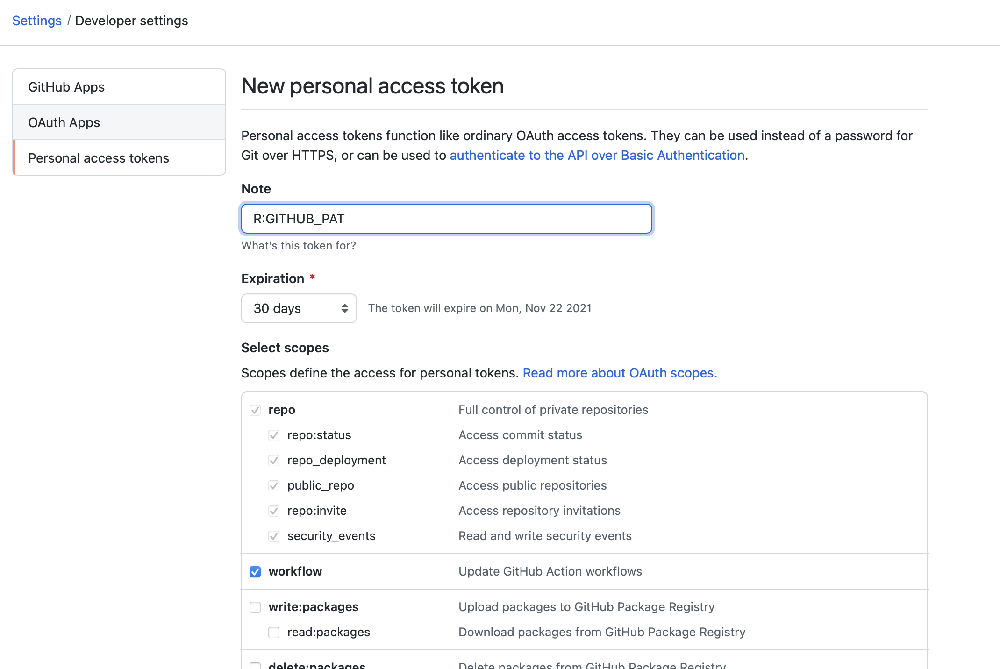

```{r setup, include=FALSE}
knitr::opts_chunk$set(echo = TRUE)
```

This page will walk you through a workflow for contributing to open source projects with RStudio and GitHub. Specifically we will learn to fork/clone a GitHub repo, create a new branch, make changes and complete a pull request. Note: most - but not all - open source projects will follow a similar workflow. Be sure to go over the README for the project you want to contribute to as it will likely tell you their specific workflow. 

## Necessary packages

To follow this workflow you will need `usethis`, `gitcreds` and `gh`. If you will be working in package development, you may wish to install `devtools` in place of the last two - they're included as dependent packages. 

## Linking GitHub and RStudio

*If you already have GitHub and RStudio linked you may skip to the next section. You may also skip any steps that are already completed.*

### Step 1: Installing Git
Head over to the [git](https://git-scm.com) and download the latest version of git. The monitor on the right side of the screen should automatically detect your operating system and provide a link to the latest version (see image below). Note: if you have a Mac, a binary package of git is included with Xcode. 


### Step 2: Create a GitHub account
Next, navigate to [GitHub](https://github.com) and create an account. The free account provides enough resources for the majority of users. Once complete, be sure to write down the email you used to register and your GitHub username as you'll need them in the next step. 

### Step 3: Setting up your Git credentials
This step can be completed in either Terminal (Linux/Mac), Command Prompt (Windows) or the *Terminal* tab in RStudio. 

Run each of the following commands sequentially, replacing your username and email where appropriate. 

> `git config --global user.name "your_github_user_name"`
>
> `git config --global user.email "email_for_github_login"`
>
> `git config --list`

The first two of these commands ties your machine to your GitHub account. The last one confirms the first two ran correctly by displaying the current Git configuration. If you use multiple development environments, you only need to run this process once! No need to redo it for each one. 

### Step 4: Linking RStudio and GitHub
Now that your computer is associated with your GitHub account, we need to give RStudio permission to access your repositories. The commands here are `R` commands so we'll run them in the *Console* tab of RStudio. 

The first command will open a web browser to a page that will help generate a Personal Access Token or PAT (see image below). If you're not already logged in to GitHub, you will see a login screen first. 

> `usethis::create_github_token()



In the *Note* field, I recommend a descriptive label that will remind you what that token is for. The default is "R:GITHUB_PAT"; instead I would use "RStudio_laptop" or "RStudio_home-office". When to set the expiration for your PAT is up to you. If it is for a short project or on a work device, I would recommend a relatively short expiration. The maximum is one year. After you've generated your token, copy it to the clipboard and head back to RStudio for the next line of code. 

> `gitcreds::gitcreds_set()`

This will prompt you to enter your token. Paste it into the console and press enter. The following line of code will confirm that we've completed our setup. 

> `gh::gh_whoami()`

You should see your name, login, html_url, scopes (set during the token generation) and the token. Note only the first three and last four characters of the token are printed. No we're ready to contribute to a project! 

## Contributing to a project
For this section, we'll be contributing to a demo repository. Code in this section will be run in the *Console* tab unless otherwise specified.

### Fork and clone
First, we need to fork and clone the project we wish to contribute to. 

> `usethis::create_from_github("npaterno/learning_git", fork = TRUE)`

This will do two things. First, it will fork the repository in GitHub. This means is will create a carbon copy of the original repository under your user account. You can make changes to this repository as much as you like without changing code in the main repo, called the *upstream* repository. 

Second, it will clone your forked repository into a new directory on your machine - the *origin* repository - that is linked to your carbon copy repository - the *remote* repository. 

### Branching
Next, we want to create a new temporary branch to make our changes. This allows us to make a change to the repository without - potentially - causing problems in the main branch. In practice, this allows developers to add features or implement bug fixes and test them without accidentally breaking production code. If they **do** break code, its ok because its isolated on the new branch. 

> `usethis::pr_init(branch = "branch-name")`

You want to use an informative branch name. There are a few naming conventions floating around the web but a fairly standard one is **type_description** or **author_type_description**. For this example, I would use either **feature_added-new-user** or **npaterno_feature_added-new-user**. 

Open the "user.txt" file. On a new line, add your github username, an approximate location and your favorite morning beverage. Then save the file and transition to the *terminal* tab.

### Committing changes
Run the code below in sequence. 

> `git add user.txt`
>
> `git commit -m "new-user: *your_user_name*"`
> 
> `git push origin main` 

### Pull Requests (PR)
Now that we've updated our carbon copy repo, we want to request that the maintainer(s) of the parent repo merges our changes. Before doing so, its a good idea to run this: 

> `usethis::pr_pause()`

This will freeze your temporary branch and merge and changes that have been made to the parent repo to ensure that you are branching from the most up-to-date version of the parent repo. Now we're ready to push our pull request to GitHub. 

> `usethis::pr_resume()`
>
> `usethis::pr_push()`

This will open up a GitHub page. Click on the green "Create pull request" button. Fill out the form and press "Create pull request" a second time. This will submit a pull request to the maintainer(s) of the parent repo. They will either merge your request or possibly ask that you make some changes to the PR before it is merged. 

Once the maintainer(s) have merged your PR, you should receive an email stating as much. Once you have that email, hop back into RStudio and run this in the console: 

> `usethis::pr_finish()`

This will do a few things: switch to your main branch, pull changes from down to your local machine, delete your local temporary branch = and delete your remote temporary branch. Your changes now live on the main branch of the parent repo and your carbon copy has been updated to reflect the changes. Congratulations! You've made your first contribution to an open source project! 